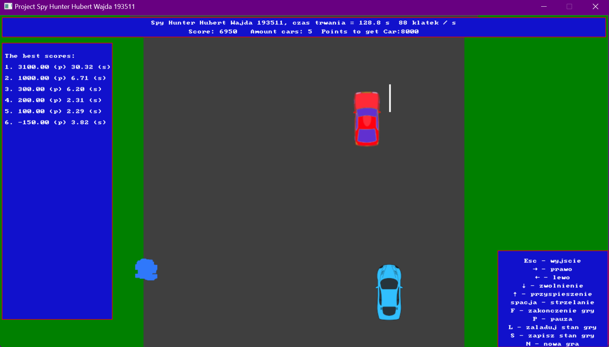
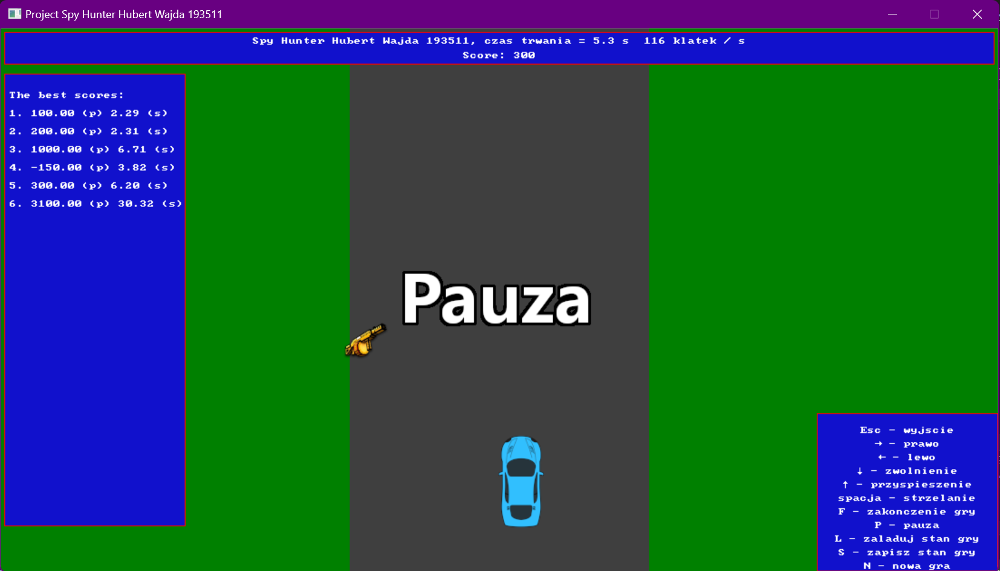
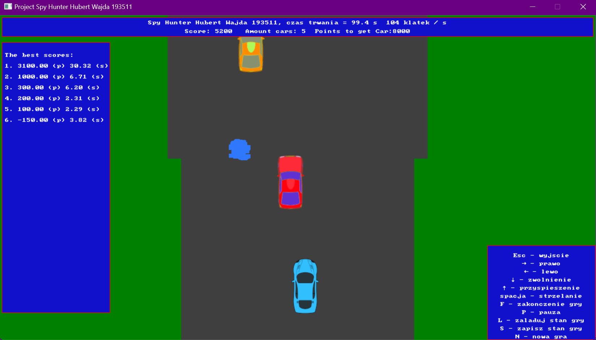

# Spy_hunter
Spy hunter is a game that simulates a car driving.  Player gets point for driving distance 
and killing enemy car(Red Car). Enemy cars are blocking the road. He can get negative points for driving off the road or
killing natural car (Green Car). Player should avoid obstacles (puddles), because they cause skid.
Player can also get super ammo, which has longer shot distnace.

I had made this project, before I got to know Git.
## How to run
* Clone the repository to your local machine: https://github.com/WajdaHub/Spy_hunter.git
* Extract template-project-2.zip
* Open 'szablon2vs17.vcxproj' in Visual Studio
* Add files in explorer window from folder 'src' 
* Click F5
## How to play
* arrows: moving the player in given direction
* esc: quit the program;
* n: start a new game;
* s: save the game state;
* l: load the game state;
*  p: pause/continue;
* space: shooting; 
* f: finish the game.
Player can also display the best score by: time (click t) or points (click o)

## Preview

